# System Architecture

## Overview Diagram

## Detailed Pub/Sub Topics

## BatchOrchestratorWorkflow - Parallel Tasks

```mermaid
flowchart TB
    subgraph Orchestrator["BatchOrchestratorWorkflow"]
        Start["Start Workflow"]
        
        subgraph Parallel["⚡ Task.WhenAll (5 Parallel Tasks)"]
            direction LR
            T1["🔄 ServiceC<br/>Data Processing<br/>(fire-and-forget + wait)"]
            T2["✅ Validation<br/>Activity<br/>(2s delay)"]
            T3["📊 Enrichment<br/>Activity<br/>(4s delay)"]
            T4["📧 Notification<br/>Activity<br/>(1.5s delay)"]
            T5["👤 Approval<br/>External Event<br/>(3 min timeout)"]
        end
        
        Collect["Collect Results"]
        Complete["Return BatchOrchestratorOutput"]
    end

    Start --> Parallel
    T1 & T2 & T3 & T4 & T5 --> Collect
    Collect --> Complete
```

## ServiceC Data Processing Flow

## Request Flow - Complete Sequence

## Component Summary

| Service | Technology | Port | Dapr Port | Role |
|---------|------------|------|-----------|------|
| ServiceA | .NET 8.0 | 5001 | 3500 | API Gateway, Workflow Orchestration |
| ServiceB-1 | .NET 8.0 | 5002 | 3502 | Batch Processing Worker |
| ServiceB-2 | .NET 8.0 | 5012 | 3512 | Batch Processing Worker |
| ServiceB-3 | .NET 8.0 | 5022 | 3522 | Batch Processing Worker |
| ServiceC | Python FastAPI | 5003 | 3503 | Data Processing Service |
| Redis | Redis 7 | 6379 | - | State Store & Pub/Sub |

## Dapr Building Blocks Used

| Building Block | Component | Usage |
|----------------|-----------|-------|
| **Pub/Sub** | pubsub.redis | Async messaging between services |
| **State Store** | state.redis | Workflow state, response storage |
| **Workflow** | Dapr.Workflow | Durable orchestration in ServiceA & ServiceB |
| **Bindings** | statebackup | File output for state backup |
